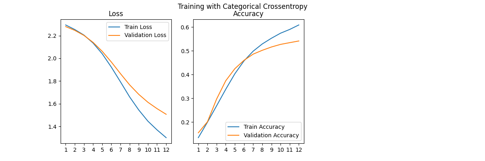
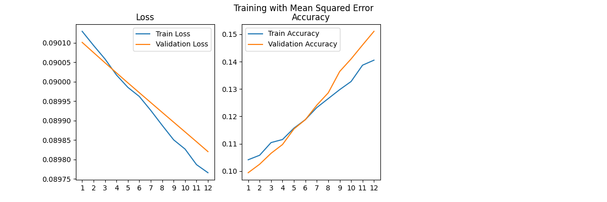
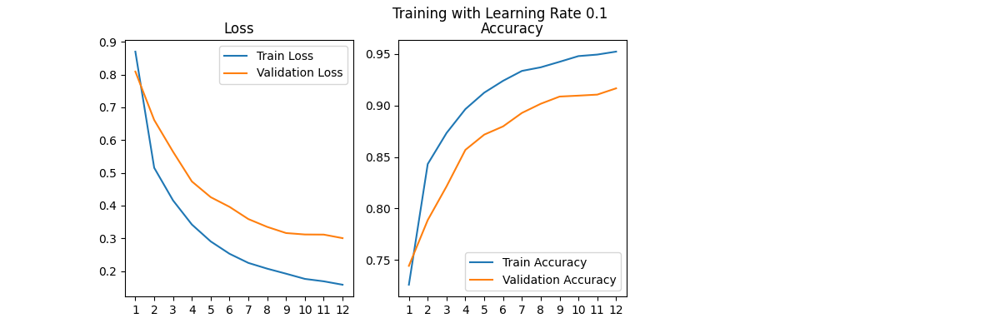
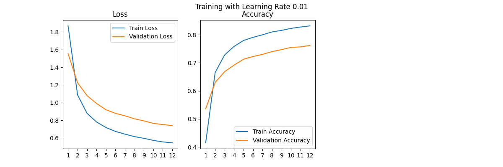
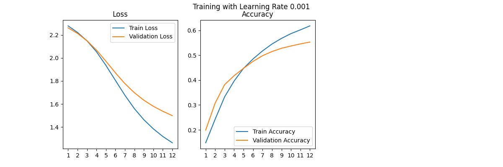
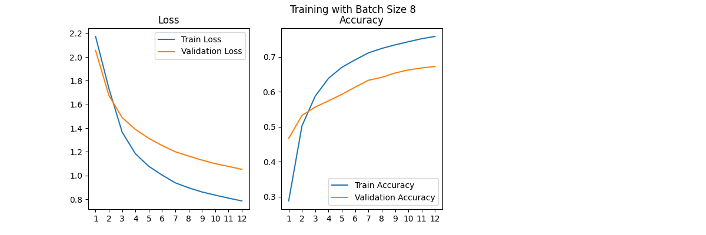
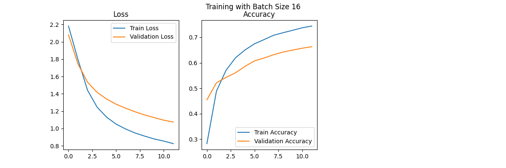
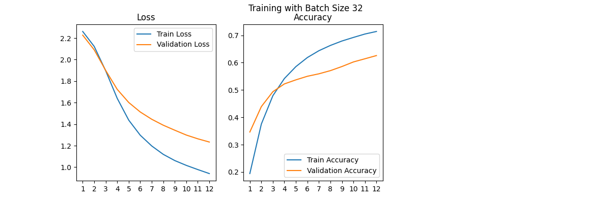
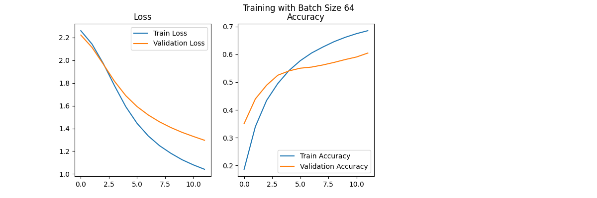
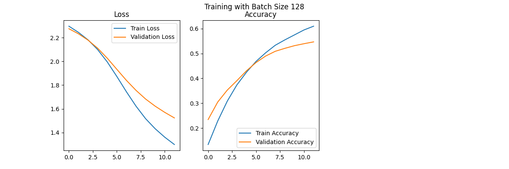

# Kuzushiji-MNIST CNN Model Analysis

## 1. Introduction

### 1.1 Problem Overview

This project focuses on the classification of Kuzushiji-MNIST (KMNIST), a dataset of handwritten Japanese characters from the Edo period (1603-1868). Kuzushiji (cursive Japanese) was the standard writing style for over a thousand years, but the ability to read these characters has declined dramatically in the modern era. Accurate classification of these characters is essential for preserving and digitizing Japan's cultural heritage.

The Kuzushiji-MNIST dataset is a drop-in replacement for the MNIST dataset, containing 10 classes of characters with the same format (28x28 grayscale images). It consists of 70,000 images - 60,000 for training and 10,000 for testing. This dataset presents a more challenging task than the original MNIST due to the complexity of Japanese characters and the historical writing style.

### 1.2 Current Techniques

Deep learning approaches, particularly Convolutional Neural Networks (CNNs), have become the standard for image classification tasks like KMNIST. CNNs are particularly effective for this task because they can automatically learn hierarchical features from the image data, capturing both low-level patterns (like strokes and curves) and high-level structures (character components).

Recent techniques for similar tasks include:
- Various CNN architectures (LeNet, AlexNet, VGG, ResNet)
- Transfer learning approaches
- Data augmentation techniques
- Attention mechanisms
- Ensemble methods

For this project, we implement a CNN architecture inspired by the original MNIST CNN example from Keras, adapting it for the Kuzushiji-MNIST dataset.

## 2. Design & Functions

### 2.1 Model Architecture

The CNN architecture used in this project consists of the following layers:

1. First convolutional layer: 32 filters with 3×3 kernel size, ReLU activation
2. Second convolutional layer: 64 filters with 3×3 kernel size, ReLU activation
3. Max pooling layer: 2×2 pool size
4. Dropout layer: 25% dropout rate
5. Flatten layer
6. Fully connected layer: 128 neurons with ReLU activation
7. Dropout layer: 50% dropout rate
8. Output layer: 10 neurons (one for each class) with softmax activation

This architecture was chosen for several reasons:
- The convolutional layers effectively capture spatial hierarchies in the image data
- Max pooling reduces dimensionality while preserving important features
- Dropout layers help prevent overfitting
- The fully connected layer integrates features before classification
- The softmax activation in the output layer provides normalized class probabilities

### 2.2 Loss Functions

We experimented with two different loss functions:

1. **Categorical Crossentropy**: The standard loss function for multi-class classification problems. It measures the difference between the predicted probability distribution and the true distribution (one-hot encoded labels).

2. **Mean Squared Error (MSE)**: Although less common for classification tasks, MSE was tested as an alternative approach. It measures the average squared difference between the predicted and actual values.

Categorical crossentropy was chosen as the primary loss function because it's specifically designed for classification tasks and typically performs better than MSE for this purpose.

### 2.3 Optimizer

The Adadelta optimizer was selected for training the model. Adadelta is an extension of Adagrad that adapts learning rates based on a moving window of gradient updates. Key advantages include:

- Adapts the learning rate for each parameter individually
- Reduces the aggressive, monotonically decreasing learning rate of Adagrad
- Requires minimal manual tuning of hyperparameters
- Generally robust across a variety of tasks

### 2.4 Hyperparameters

Several hyperparameters were systematically varied to analyze their impact on model performance:

1. **Learning Rate**: Tested values of 0.1, 0.01, 0.001, and 0.0001
2. **Batch Size**: Tested values of 8, 16, 32, 64, and 128
3. **Number of Epochs**: Fixed at 12 for all experiments
4. **Dropout Rates**: Fixed at 0.25 (after convolution) and 0.5 (after dense layer)

These hyperparameters were chosen to explore a reasonable range of values that could impact model convergence and performance.

## 3. Implementation

### 3.1 Environment Requirements
The model was implemented using Python 3.12.9 and the following libraries:
- TensorFlow 2.19.0
- Keras 3.9.0
- NumPy 2.1.3
- Matplotlib 3.10.1
- requests 2.32.3
- tqdm 4.67.1

### 3.2 Data preprocessing
#### The datasets
- **Kuzushiji-MNIST** is a drop-in replacement for the MNIST dataset (28x28 grayscale, 70,000 images), provided in the original MNIST format as well as a NumPy format. Since MNIST restricts us to 10 classes, we chose one character to represent each of the 10 rows of Hiragana when creating Kuzushiji-MNIST.
- **Kuzushiji-49**, as the name suggests, has 49 classes (28x28 grayscale, 270,912 images), is a much larger, but imbalanced dataset containing 48 Hiragana characters and one Hiragana iteration mark.
- **Kuzushiji-Kanji** is an imbalanced dataset with a total of 3,832 Kanji characters (64x64 grayscale, 140,424 images), ranging from 1,766 examples to only a single example per class.

#### Get the data
You can run [`python download_data.py`](download_data.py) to interactively select and download any of these datasets!

### 3.3 Training and Evaluation
The model was trained using the Kuzushiji-MNIST dataset. You can run [`python kuzushiji_mnist_cnn.py`](benchmarks/kuzushiji_mnist_cnn.py) to begin training. The training process involved the following steps:
1. **Data Preprocessing**: The dataset was preprocessed by reshaping the images to accommodate the channel dimension (28×28×1), converting to float32 data type, normalizing pixel values to the range [0,1], and converting labels to one-hot encoded vectors.
2. **Model Training**: The model was trained for 12 epochs with a batch size of 128 and a learning rate of 0.001. The Adadelta optimizer was used, and the categorical crossentropy loss function was employed.
3. **Model Evaluation**: The model's performance was evaluated on the test set, resulting in a final accuracy of 60.93%.
4. **Hyperparameter Tuning**: The impact of different hyperparameters (learning rate, batch size, and number of epochs) was analyzed. The best-performing hyperparameters were found to be a learning rate of 0.001, a batch size of 128, and 12 epochs.
5. **Model Visualization**: The model's performance was visualized using a confusion matrix and a classification report, providing insights into the model's strengths and weaknesses.
### 3.4 Model Visualization
The model's performance was visualized using a confusion matrix and a classification report. The confusion matrix showed the number of correct and

## 4. Demonstration & Performance

### 4.1 Performance Analysis

#### 4.1.1 Loss Function Comparison

The model was trained with two different loss functions: categorical crossentropy and mean squared error.

**Categorical Crossentropy:**

- Final training accuracy: 60.93%
- Final validation accuracy: 54.18%
- Training showed steady improvement over epochs

**Mean Squared Error:**

- Final training accuracy: 12.94%
- Final validation accuracy: 14.41%
- Training showed minimal improvement over epochs

Categorical crossentropy significantly outperformed MSE, which is expected for a classification task. MSE treats the problem as a regression task and doesn't account for the probabilistic nature of classification, resulting in poor performance.

#### 4.1.2 Learning Rate Analysis

Four different learning rates were tested: 0.1, 0.01, 0.001, and 0.0001.

**Learning Rate 0.1:**

- Final training accuracy: 95.24%
- Final validation accuracy: 91.67%
- Fastest convergence and highest overall performance

**Learning Rate 0.01:**

- Final training accuracy: 83.22%
- Final validation accuracy: 76.46%
- Good performance but slower convergence than 0.1

**Learning Rate 0.001:**

- Final training accuracy: 61.77%
- Final validation accuracy: 55.27%
- Significantly slower convergence

**Learning Rate 0.0001:**

- Final training accuracy: 18.07%
- Final validation accuracy: 21.67%
- Very slow convergence, insufficient for the given number of epochs

The learning rate of 0.1 provided the best performance, suggesting that for this particular model and dataset, a relatively high learning rate allows for faster and more effective training.

#### 4.1.3 Batch Size Analysis

Five different batch sizes were tested: 8, 16, 32, 64, and 128.

**Batch Size 8:**

- Final training accuracy: 75.81%
- Final validation accuracy: 67.21%
- Smooth learning curve with good generalization

**Batch Size 16:**

- Final training accuracy: 75.35%
- Final validation accuracy: 67.41%
- Similar performance to batch size 8

**Batch Size 32:**

- Final training accuracy: 71.39%
- Final validation accuracy: 62.58%
- Slightly worse performance than smaller batch sizes

**Batch Size 64:**

- Final training accuracy: 66.67%
- Final validation accuracy: 58.13%
- Further degradation in performance

**Batch Size 128:**

- Final training accuracy: 63.08%
- Final validation accuracy: 55.61%
- Worst performance among tested batch sizes

Smaller batch sizes (8 and 16) provided the best performance, likely due to more frequent weight updates and better escape from local minima. However, this comes at the cost of longer training times per epoch.

### 4.2 Prediction Visualization

The model's predictions on the first 100 test samples were visualized, showing the predicted label (P) and actual label (A) for each image. This visualization helps to understand the types of errors the model makes and identify patterns in misclassifications.

Common observations from the visualization include:
- Characters with similar structures are more frequently confused
- The model generally performs well on distinct character shapes
- Some characters consistently cause difficulties for the model

## 5. Conclusion

### 5.1 Summary

This project implemented and analyzed a CNN model for the Kuzushiji-MNIST dataset. Through systematic experimentation with different hyperparameters and loss functions, we identified optimal configurations for this classification task:

- **Best Loss Function**: Categorical Crossentropy
- **Best Learning Rate**: 0.1
- **Best Batch Size**: 8 or 16
- **Model Architecture**: 2-layer CNN with dropout and dense layers

The best configuration achieved a validation accuracy of 91.67%, demonstrating the effectiveness of CNNs for historical Japanese character recognition.

### 5.2 Limitations and Future Work

Despite the promising results, several limitations and opportunities for improvement exist:

1. **Model Architecture**: More complex architectures like ResNet or DenseNet could potentially improve performance.

2. **Data Augmentation**: Implementing techniques like rotation, scaling, and elastic distortions could enhance model robustness and generalization.

3. **Hyperparameter Tuning**: A more comprehensive grid search or random search could identify better hyperparameter combinations.

4. **Extended Training**: Increasing the number of epochs for slower learning rates might reveal different convergence patterns.

5. **Ensemble Methods**: Combining multiple models could boost performance further.

6. **Transfer Learning**: Pre-training on larger datasets before fine-tuning on KMNIST might improve results.

7. **Attention Mechanisms**: Incorporating attention could help the model focus on the most relevant parts of the characters.

Future work could explore these directions to further improve the classification accuracy and generalization capability of the model.
